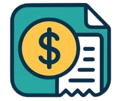

# LedgerLite

  

**LedgerLite** is a Kotlin-based console application that enables efficient personal expense tracking. It allows users to monitor their spending, categorize expenses, and generate comprehensive monthly summaries.

---

## Features  

- **Add Expense**  
  - Enter date (defaults to today if blank)  
  - Description of the expense  
  - Category (Food, Transport, Entertainment, Bills, Other)  
  - Positive amount validation  

- **View All Expenses**  
  - Sorted by most recent date  
  - Clean, table-like display  

- **Search Expenses**  
  - Filter by category or keyword in the description  

- **Monthly Summary**  
  - Total spent per category for the current month  
  - Overall total spent  

- **Delete Expense**  
  - Remove an expense by selecting its index from the list  

- **Persistent Storage**  
  - Saves all expenses to a local file (`expenses.txt`)  
  - Loads data automatically on startup  

---

## Stretch Goals
- Allow the user to view by individual months for the category chosen
